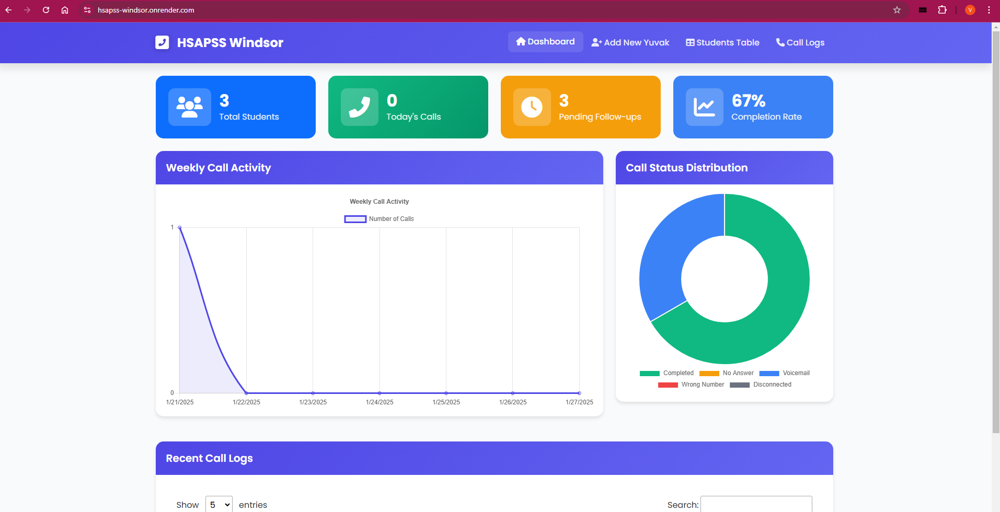
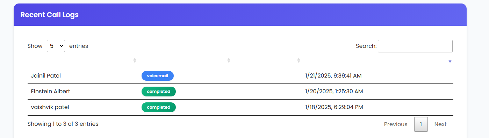
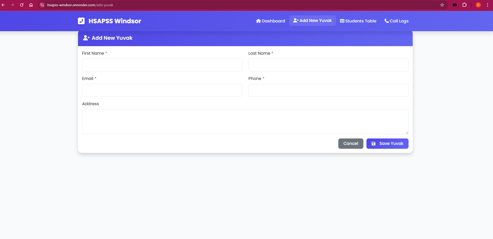
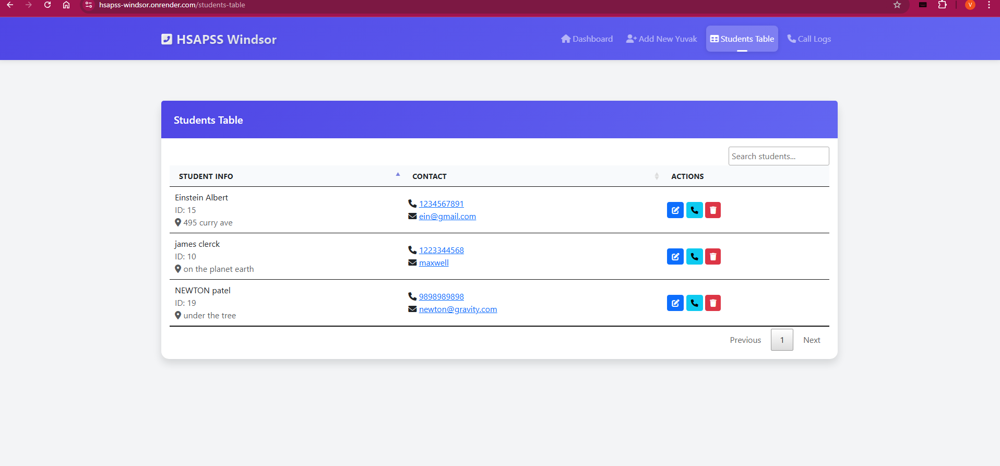
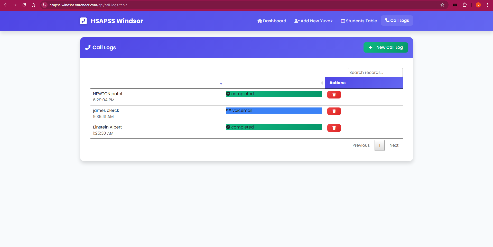

# Student Management System

## **Screenshots of HSAPSS Windsor Web App**


## Recent call logs


## Add New Student



## Student Table



## Call Logs


A comprehensive web application for managing student records, attendance, and call logs built with Node.js and Express.js.

## Features

- 👥 Student Management (CRUD operations)
- 📞 Call Logging System
- 📊 Attendance Tracking
- 📱 Responsive Dashboard
- 🔒 Authentication System
- 📄 Data Export Functionality
- 🌓 Dark/Light Theme Support

## Project Structure

```
HSAPSS_WINDSOR/
├── config/
│   ├── db.js                 # Database configuration
│   ├── middleware.js         # Application middleware
│   └── auth.js              # Authentication configuration
├── models/
│   └── StudentModel.js      # Student database model
├── public/
│   ├── css/                 # Stylesheets
│   └── images/              # Static images
├── routes/
│   ├── AuthRoutes.js        # Authentication routes
│   ├── pages.js             # Page rendering routes
│   ├── StudentRoutes.js     # Student management routes
│   └── students.js          # Student API endpoints
├── views/
│   ├── add-yuvak.html       # Student addition form
│   ├── call-logs-table.html # Call logging interface
│   ├── index.html           # Dashboard
│   ├── login.html           # Login page
│   └── students-table.html  # Student list view
├── .env                     # Environment variables
├── app.js                   # Application entry point
├── server.js               # Server configuration
└── package.json            # Project dependencies
```

## Prerequisites

- Node.js (v14 or higher)
- MongoDB
- npm or yarn package manager

## Installation

1. Clone the repository:
```bash
git clone https://github.com/PatelVaishvikk/HSAPSS-Windsor
cd HSAPSS_WINDSOR
```

2. Install dependencies:
```bash
npm install
```

3. Create a `.env` file in the root directory and add the following variables:
```env
PORT=3000
MONGODB_URI=your_mongodb_connection_string
JWT_SECRET=your_jwt_secret
```

4. Start the development server:
```bash
npm run dev
```

## Usage

1. Access the application at `http://localhost:3000`
2. Log in using your credentials
3. Navigate through the dashboard to:
   - Manage student records
   - Track attendance
   - Log calls
   - Generate reports
   - Export data

## API Endpoints

### Authentication
- `POST /auth/login` - User login
- `POST /auth/logout` - User logout

### Student Management
- `GET /api/students` - Get all students
- `POST /api/students` - Add new student
- `PUT /api/students/:id` - Update student
- `DELETE /api/students/:id` - Delete student

### Call Logs
- `GET /api/calls` - Get all call logs
- `POST /api/calls` - Add new call log
- `GET /api/calls/:studentId` - Get calls for specific student

## Technologies Used

- **Backend:**
  - Node.js
  - Express.js
  - MongoDB
  - Mongoose

- **Frontend:**
  - HTML5
  - CSS3 (with Tailwind CSS)
  - JavaScript
  - Font Awesome Icons

- **Authentication:**
  - JWT (JSON Web Tokens)

## Security Features

- Password hashing
- JWT authentication
- Protected routes
- Input validation
- XSS protection
- CSRF protection

## Database Schema

### Student Model
```javascript
{
  firstName: String,
  lastName: String,
  email: String,
  phone: String,
  status: String,
  lastCalled: Date,
  // Additional fields as needed
}
```

## Contributing

1. Fork the repository
2. Create your feature branch (`git checkout -b feature/AmazingFeature`)
3. Commit your changes (`git commit -m 'Add some AmazingFeature'`)
4. Push to the branch (`git push origin feature/AmazingFeature`)
5. Open a Pull Request

## License

This project is licensed under the MIT License - see the LICENSE file for details.

## Support

For support, email vaishvikpatel001@gmail.com or raise an issue in the repository.

## Acknowledgments

- Tailwind CSS for the UI components
- Font Awesome for icons
- MongoDB for database solutions
